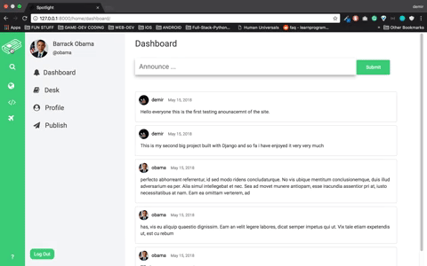

# Spotlight

This is a custom tool specially built for content creators with busy deadlines. It's meant to be used for easing your workload and eliminating the dozens of 'post-it's you stick while working on a project.

### App features are listed below:

*Once the site is up I will remove this line and add the link*

## Log In Gate

After logging in you will be welcomed with the dashboard page where you can see all of the announcements made by all of the users of the site. I didn't create a signup page intentionally because the only person who is allowed to create staff users should be the admin.
 
 
 
## Browse Desk's

Each reporter should be assigned to at least one desk because otherwise how can the boss know what are you working on. Think of 'desk's as departments in a newspaper such as 'Metro', 'Investigative Research', 'Global News' .. etc. You can name your desks whatever you want but you have to give it a category for the app to take care of the other features for your desk's.

## To-Do

After joining a desk the first thing you get redirected to is the to-do section of the desk. In this page you can create to-do tasks, mark other peoples to-do tasks as completed or delete the task completely if you want to have a clean to-do page. But remember if you delete one you cannot access to it ever again.
 
 

## New Article

At every desk you can create a new article. It does not need a lot of explanation you just type a title and the body of your article in it and the site take cares the rest of the mechanism. You may ask why you can't create an article without having to join a desk and the answer is a little bit tricky. You can create articles without having to join a desk but if you do not the article will not have a category and in that instance your article will not be archived or shown in anywhere in the app. So write your articles in the des

## In Progress & Edit Article

After submitting an article you can view your newly created article in the 'in progress' section of the desk. In here you should edit yours and other desk workers articles. Leave comments under their articles for them to see your criticism and change their articles. You should take your time in this 'progress' section and edit the desks articles.
 
 

## Done

When you are done writing, editing, fixing the comments of your article you are ready to push it to the 'done' section of the desk you are working for. In this section everybody can view the pushed articles but the main purpose of this done section is to let the 'editor' of the desk to see your work.
 
 
 

## Publish

When the 'editor' of the desk views your article he/she will decide weather the article should be pushed to 'publish' where it is the last point an article can get to. At the publish point each article lives there in order to be submitted the platform that you wish for such as Medium, your own site , etc.
 
 

## Profile

You can see your own profile for a detailed history of what you have accomplished so far. When you click the profile app link you get redirected to the contributions page where you can see your profile information such as your name, photo, description, personal link and all of your articles submitted in a chronological order.
 
 

## Desk Management & Settings

You can manage your desk's in the desk management section that can be found under the contributions page. To be fair in the desk management section you can just quit them at the moment I didnt know what to put more but if you switch to to general settings thats where you can update all of your personal info.
 
 

## Search

Lastly there is a search mechanism that you can search every article of the searched author. As I said on the top this may be the last feature but not least if there is someone who wants to use this repo I will start maintaining it and add a lot more features.
