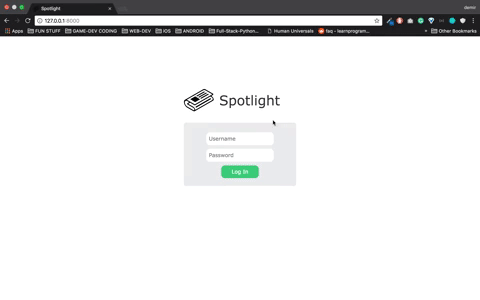
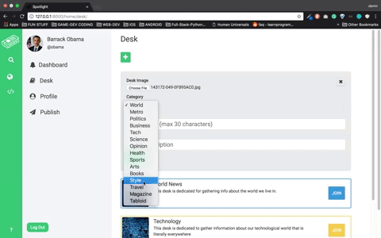

# Spotlight

This is a custom tool specially built for journalist's but if your work revolves around creating and writing articles feel free to use it. It's meant to be used for easing your workload and eliminating the dozens of 'post-it's you stick while working on a project.

### App features are listed below:

*Note: I will not maintain this project because I doubt there will ever be an interest. *

## Log In Gate

After logging in you will be welcomed with the dashboard page where you can see all of the announcements made by all of the users of the site. I didn't create a signup page intentionally because the only person who is allowed to create staff users should be the admin.
 
 

## Browse Desk's

Each reporter should be assigned to at least one desk because otherwise how can the boss know what are you working on. Think of 'desk's as departments in a newspaper such as 'Metro', 'Investigative Research', 'Global News' .. etc. You can name your desks whatever you want but you have to give it a category for the app to take care of the other features for your desk's.

## To-Do
